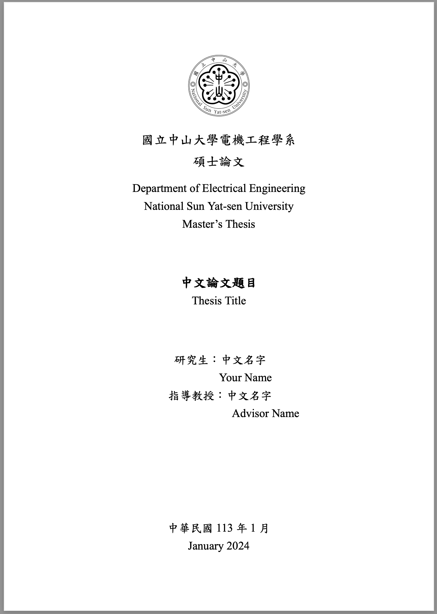

# NSYSU-國立中山大學 Latex 模板 (附docker latex編輯環境)
國立中山大學碩士論文Latex模板，附有latex環境與vscode建置流程。該環境已預先設置Times New Roman與標楷體兩種通用字型，不論是在Mac, Windows, 都不用擔心遇到字型衝突。Overleaf上編輯則需將字體改為`AR PL KaitiM Big5`。

Nsysu thesis Latex Template with latex environment and vscode easy setup. this docker environments has Times New Roamn and 標楷體 pre-installed. No more worries about compiling on different OS system. (Mac, Windows, Linux, Overleaf)

[overleaf template cite](https://www.overleaf.com/latex/templates/guo-li-zhong-shan-da-xue-nsysu-shuo-shi-lun-wen-mo-ban/pjkwmbnnndyd)


# latex環境簡易建置
- requirements: `docker`, `vscode` 
1. 下載docker latex環境image，並建立container.
```shell
docker pull chengyouhu/latex:v5
docke run -d --name [container name] chengyouhu/latex:v5 -v [local latex dir path]:/home/latex
```
[local latex dir path]就是`git clone`下來後專案資料夾的路徑。這樣可以將自己電腦端的專案資料夾跟container中的`/home/latex`連結。
2. 安裝vscode docker擴充程式
3. 側邊欄選擇docker，進container，看到建立的container後右鍵選attach vscode，這樣vscode就進latex環境了，開啟資料夾選擇剛剛設立的`/home/latex`。
4. 在container環境的vscode安裝latex, latex workshop擴充程式

## .vscode設置
`.vscode`檔案夾需要在當前工作環境內才可運作，若當前工作環境沒有`.vscode`預設會在`/home/.vscode`中。`settings.json`中，三個recipe可以調換順序，最上面的是預設的compiler，若沒有使用參考文獻則須將`"xelatex"`的組別移動到最上。
```json
"latex-workshop.latex.recipes": [
      {
          "name": "xelatex -> bibtex -> xelatex*2",
          "tools": [
              "xelatex",
              "bibtex",
              "xelatex",
              "xelatex"
          ]
      },
      {
          "name": "xelatex",
          "tools": [
              "xelatex"
          ]
      },
      {
          "name": "pdflatex -> bibtex -> pdflatex*2",
          "tools": [
              "pdflatex",
              "bibtex",
              "pdflatex",
              "pdflatex"
          ]
      },
  ],
```

# 模板說明
## 檔案結構
檔案結構主要為
- thesis.tex 主文件
- frontpages
  - `cover.tex` 封面頁
  - `validation_letter.tex` 論文審定書
  - `acknowledgement.tex` 誌謝
  - `chi_abstract.tex` 中文摘要
  - `en_abstract.tex` 英文摘要
- sections
  - `introduction.tex` 介紹
  - `related_work.tex` 文獻探討
  - `method.tex` 方法
  - `experiments.tex` 實驗結果
  - `concluison.tex` 結論
- backpages
  - `bibliography.tex` 參考文獻
  - `appendix.tex` 附錄
- packages.tex 模板設定文件
- reference.bib 參考文獻文件

根據內容決定撰寫在哪個檔案，sections中的文件可以自行透過增加/移除`.tex`檔進行調整，只需將新增的檔案在主文件`thesis.tex`中根據位置用`\input{./path/to/texfile}`新增即可。

# Acknowledgement
- latex template modified from : [hasanabs/nsysu-thesis-latex-template](https://github.com/hasanabs/nsysu-thesis-latex-template)
